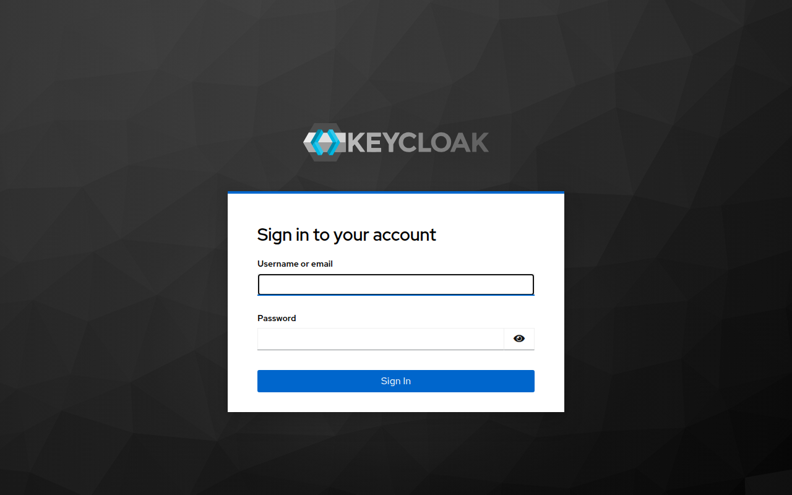
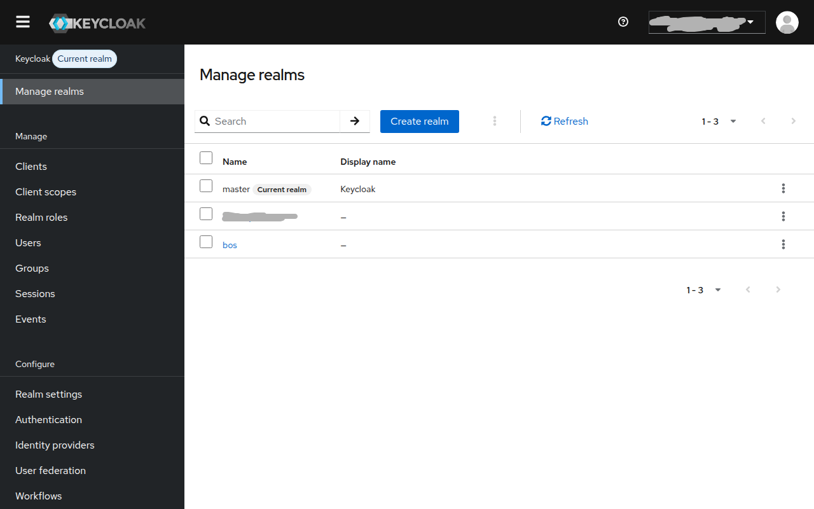
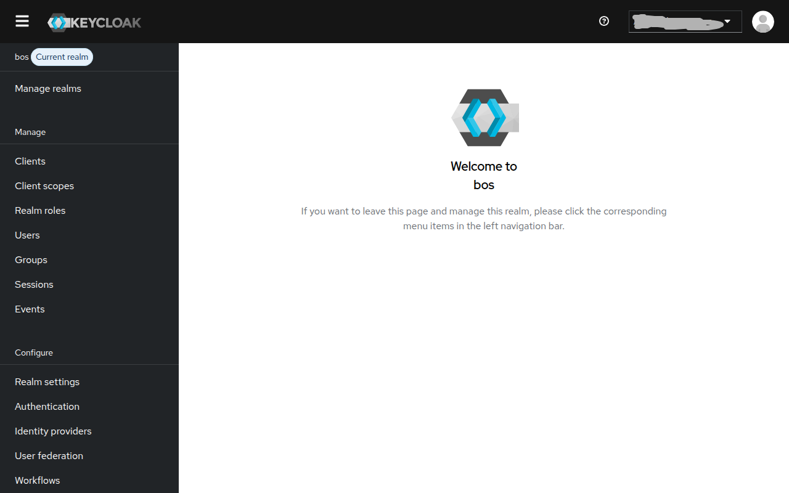
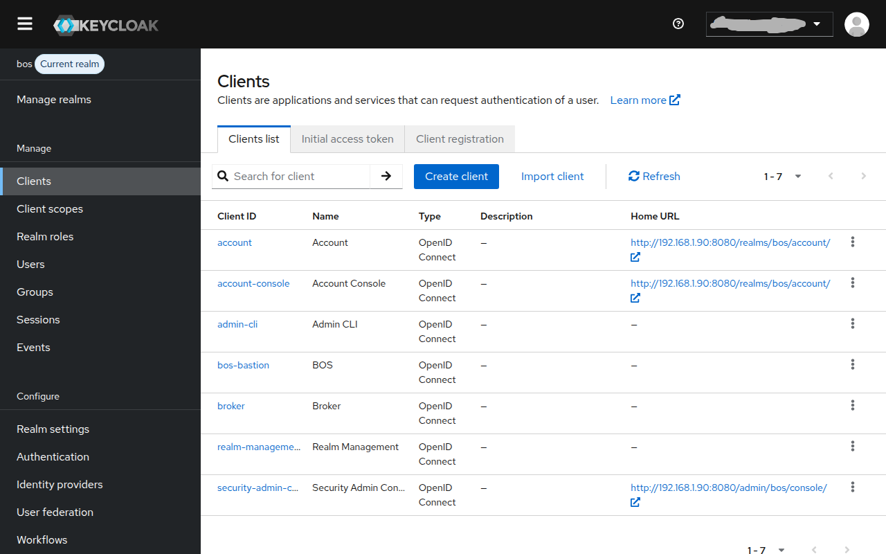
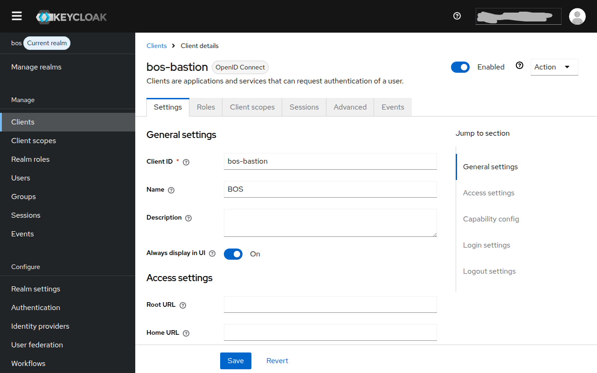
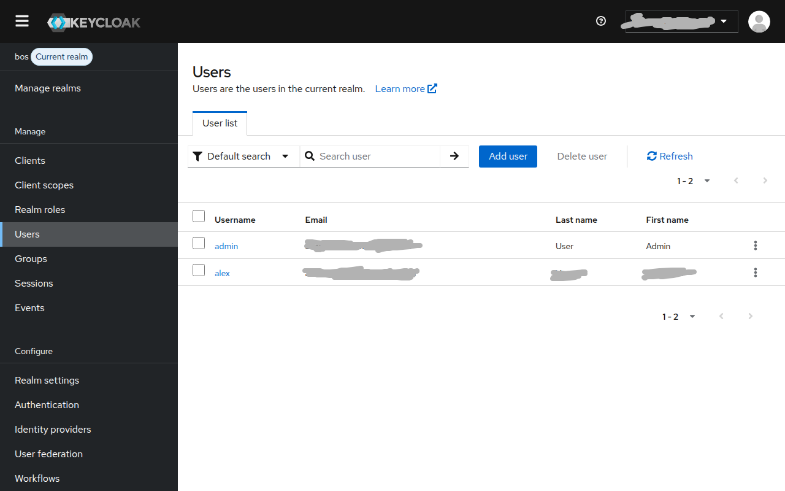
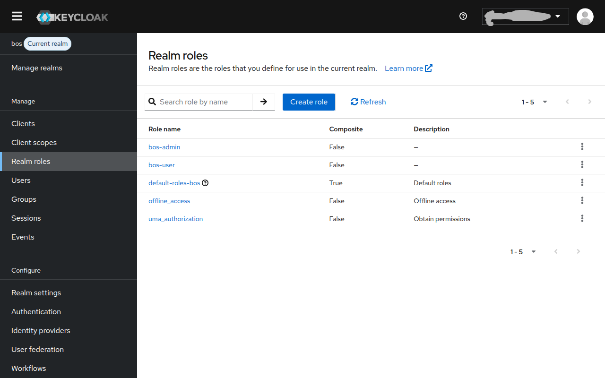

# Quickstart — Docker with Keycloak (OAuth)

This guide replaces BOS's built-in simple auth with [Keycloak](https://www.keycloak.org/) as an OpenID Connect (OIDC) identity provider. Users log in with Keycloak credentials; the bastion validates their token and maps the `bos-admin` realm role to admin access.

> **Already familiar with Docker + BOS?** Complete [docker-simple-auth.md](./docker-simple-auth.md) first — this guide assumes you have the images built and the stack running.

## How it works

```
Browser
  │  login redirect
  ▼
Keycloak :8080       ← OIDC provider (login page, token issuance)
  │  OIDC callback
  ▼
Bastion :80          ← validates token, provisions BOS containers
  │  proxy
  ▼
bos-{username} :8090 ← per-user BrowserOS container
```

The bastion never stores passwords — Keycloak owns all credentials. The `bos-admin` realm role grants access to the bastion admin portal.

---

## Path A — Use the bundled realm export (fastest)

The repo ships a pre-configured Keycloak realm at `bastion/keycloak/realm-export.json`. It contains:

- **`bos` realm** — isolated from Keycloak's own master realm
- **`bos-bastion` client** — the OAuth client the bastion authenticates as
- **`bos-admin` and `bos-user` realm roles**
- **A seed `admin` user** with a temporary password (`admin`) and the `bos-admin` role

### Step 1 — Configure `.env` for Keycloak

```bash
cp .env.example .env
```

Set these values in `.env`:

```env
# Required — generate with: openssl rand -hex 32
JWT_SECRET=<your-64-char-hex-secret>

AUTH_PROVIDER=keycloak

# Keycloak runs in the same Docker network as the bastion.
# Use the service name "keycloak" as the hostname.
KEYCLOAK_ISSUER=http://keycloak:8080/realms/bos
KEYCLOAK_CLIENT_ID=bos-bastion
KEYCLOAK_CLIENT_SECRET=change-me-in-production
KEYCLOAK_USERNAME_CLAIM=preferred_username
KEYCLOAK_ADMIN_ROLE=bos-admin

PUBLIC_URL=http://localhost    # change to your server's public hostname
BOS_IMAGE=browseros:latest
```

> **`KEYCLOAK_CLIENT_SECRET`** must match what is configured in Keycloak for the `bos-bastion` client. The realm export ships with `change-me-in-production` — change it before going to production (see [Step 3](#step-3--update-the-client-secret-and-redirect-uri) below).

### Step 2 — Start the stack with Keycloak

The `docker-compose.keycloak.yml` override adds a Keycloak service and auto-imports the `bos` realm from `bastion/keycloak/realm-export.json`:

```bash
docker compose -f docker-compose.yml -f docker-compose.keycloak.yml up -d
```

Keycloak takes ~30 seconds to start. Watch its logs:

```bash
docker compose logs -f keycloak
# Wait for: "Keycloak 24.x.x started"
```

After Keycloak is ready, the bastion connects to it automatically.

### Step 3 — Update the client secret and redirect URI

The shipped realm export uses a placeholder secret and `localhost` redirect URIs. Update both before using in production.

**Open the Keycloak admin console** at `http://localhost:8080/admin` (default credentials: `admin` / `admin`).



**Switch to the `bos` realm** — click **Manage realms** in the left sidebar, then click **bos**.





**Navigate to Clients → bos-bastion.**





Scroll down to **Access settings** and update the **Valid redirect URIs** to match your public URL:

```
http://your-server/auth/callback
https://your-server/auth/callback   ← if using HTTPS
```

Save the settings.

**Get or regenerate the client secret** — click the **Credentials** tab:

- Copy the **Client secret** value
- Or click **Regenerate** to issue a fresh one

Paste the secret into `KEYCLOAK_CLIENT_SECRET` in your `.env`, then restart the bastion:

```bash
docker compose restart bastion
```

### Step 4 — Change the seed admin password

The realm export includes a seed `admin` user with the temporary password `admin`. Change it immediately.

In the Keycloak admin console, go to **Users** and click **admin**. On the **Credentials** tab, set a new permanent password.



### Step 5 — Add your real users

Still in **Users**, click **Add user**. Fill in the username (must match `[a-z0-9_-]` for BOS compatibility), then on the **Role mapping** tab assign the `bos-admin` or `bos-user` realm role.



The two BOS roles are:

| Role | Access |
|------|--------|
| `bos-admin` | Full access — login, admin portal, manage other users |
| `bos-user` | Login only — gets a personal BOS container |

> Users without either role can still authenticate with Keycloak but will be treated as regular (non-admin) BOS users.

### Step 6 — Log in

Visit `http://localhost` (or your `PUBLIC_URL`). The bastion redirects to Keycloak's login page. After a successful login, Keycloak redirects back to the bastion with a token, the bastion provisions the user's container on first visit, and the user lands on their BOS desktop.

---

## Path B — Configure Keycloak manually (no realm import)

Use this path when you have an existing Keycloak instance you cannot import realms into, or when you want full control over the configuration.

### Prerequisites

- A running Keycloak 24+ instance accessible from both the browser and the bastion Docker network
- Admin credentials for Keycloak

### Step 1 — Create the `bos` realm

Log in to the Keycloak admin console. Click **Manage realms** in the sidebar.


Click **Create realm**. Set:

- **Realm name:** `bos`
- **Enabled:** On

Save.

### Step 2 — Create realm roles

Switch to the `bos` realm (click **Manage realms → bos**). Navigate to **Realm roles** in the left sidebar.


Click **Create role** twice and create:

| Role name | Description |
|-----------|-------------|
| `bos-admin` | BrowserOS admin access |
| `bos-user` | BrowserOS regular user |

### Step 3 — Create the `bos-bastion` OpenID Connect client

Navigate to **Clients → Create client**.

**General settings:**
- Client type: `OpenID Connect`
- Client ID: `bos-bastion`
- Name: `BOS`

Click **Next**.

**Capability config:**
- Client authentication: **On** (this makes it a confidential client with a secret)
- Standard flow: **On**
- All other flows: **Off**

Click **Next**.

**Login settings:**
- Valid redirect URIs: `http://your-server/auth/callback`  
  Add `http://localhost/auth/callback` for local testing.
- Web origins: `http://your-server`

Click **Save**.

The client is created. Navigate to the **Credentials** tab to copy the client secret — you will need this for `.env`.

### Step 4 — Configure `.env`

```env
AUTH_PROVIDER=keycloak
JWT_SECRET=<openssl rand -hex 32>

# Replace with your Keycloak hostname — visible from the browser AND from within Docker
KEYCLOAK_ISSUER=http://<keycloak-host>:8080/realms/bos
KEYCLOAK_CLIENT_ID=bos-bastion
KEYCLOAK_CLIENT_SECRET=<from Credentials tab>
KEYCLOAK_USERNAME_CLAIM=preferred_username
KEYCLOAK_ADMIN_ROLE=bos-admin

PUBLIC_URL=http://your-server
BOS_IMAGE=browseros:latest
```

> **`KEYCLOAK_ISSUER` hostname:** the bastion calls the Keycloak issuer URL from inside Docker. If Keycloak runs on the host machine (not in Docker), use `host.docker.internal` on Linux/Mac or the host's LAN IP. If Keycloak is in the same Docker Compose network (e.g. using the bundled `docker-compose.keycloak.yml`), use the service name `keycloak`.

### Step 5 — Create users and assign roles

In the `bos` realm, go to **Users → Add user**. Set the username (must be `[a-z0-9_-]`), save, then on the **Credentials** tab set a password.

On the **Role mapping** tab, click **Assign role**, filter by **Filter by realm roles**, and assign `bos-admin` or `bos-user`.

### Step 6 — Start the bastion

If you are using an external Keycloak (not the bundled one), start only the bastion:

```bash
docker compose up -d
```

If you want the bundled Keycloak alongside your manual config, use the override:

```bash
docker compose -f docker-compose.yml -f docker-compose.keycloak.yml up -d
```

---

## Updating the realm export

When you make changes in Keycloak that should be preserved for future deployments (new roles, client scopes, default user attributes), export the updated realm:

1. In the Keycloak admin console, go to the `bos` realm → **Realm settings** → **Action menu** (top right) → **Export**.
2. Enable **Export clients** and optionally **Export groups and roles**. Keep **Export users** off — user accounts should not be committed to the repo.
3. Download the JSON and replace `bastion/keycloak/realm-export.json` in the repository.

The exported file is auto-imported by the bundled Keycloak service on first start (`--import-realm` flag in `docker-compose.keycloak.yml`). It is **not** re-imported if the realm already exists — so re-importing requires either removing the Keycloak data volume or using the admin console to import manually.

---

## Troubleshooting

### "invalid_redirect_uri" after login

The redirect URI in Keycloak does not match the one the bastion is sending. Check:
- **Valid redirect URIs** in the `bos-bastion` client settings includes your `PUBLIC_URL/auth/callback`
- `PUBLIC_URL` in `.env` matches the hostname the browser uses to reach the bastion (Keycloak compares the exact callback URL)

### "could not discover issuer" on bastion startup

The bastion cannot reach Keycloak at `KEYCLOAK_ISSUER`. Check:
- Keycloak is running: `docker compose logs keycloak`
- The hostname in `KEYCLOAK_ISSUER` is reachable from inside the bastion container
- If using the bundled Keycloak, use `http://keycloak:8080/realms/bos` (service name, not `localhost`)

### Users land on the Keycloak login but cannot log in

- Check the user exists in the **`bos` realm** (not the master realm)
- Verify the user's credentials on the **Credentials** tab
- Ensure the user has at least one of `bos-admin` or `bos-user` mapped — users with no BOS role still authenticate but are treated as regular users

### Admin portal shows "User management is handled by Keycloak"

This is expected behaviour in Keycloak mode. The bastion cannot create or delete Keycloak users — use the Keycloak admin console instead.

---

## Next steps

- [docs/usage/deployment.md](../deployment.md) — full deployment reference including re-provision operations
- [Keycloak documentation](https://www.keycloak.org/documentation) — realm settings, user federation, MFA, and more
