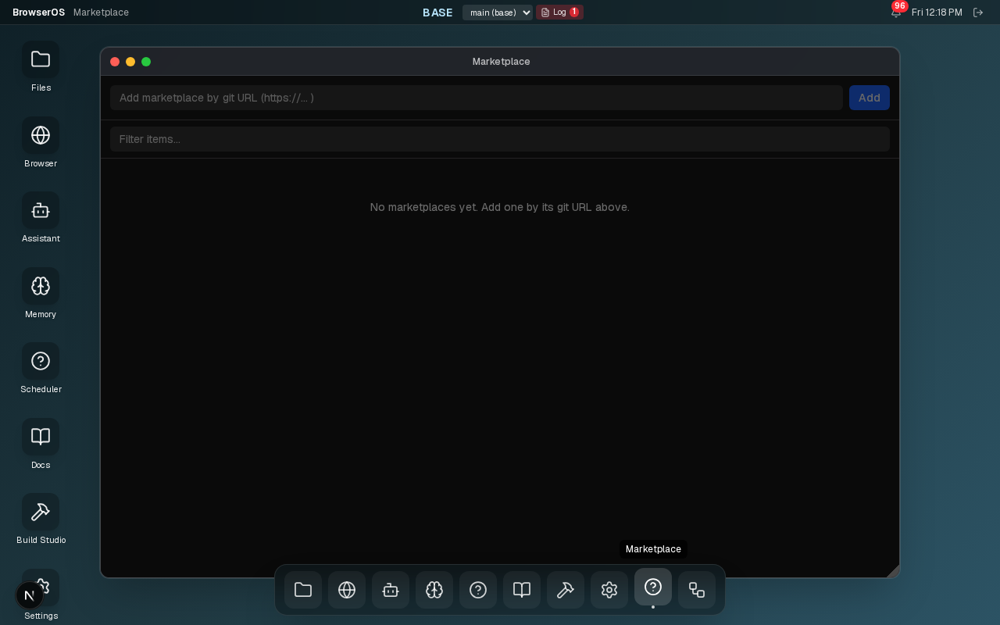
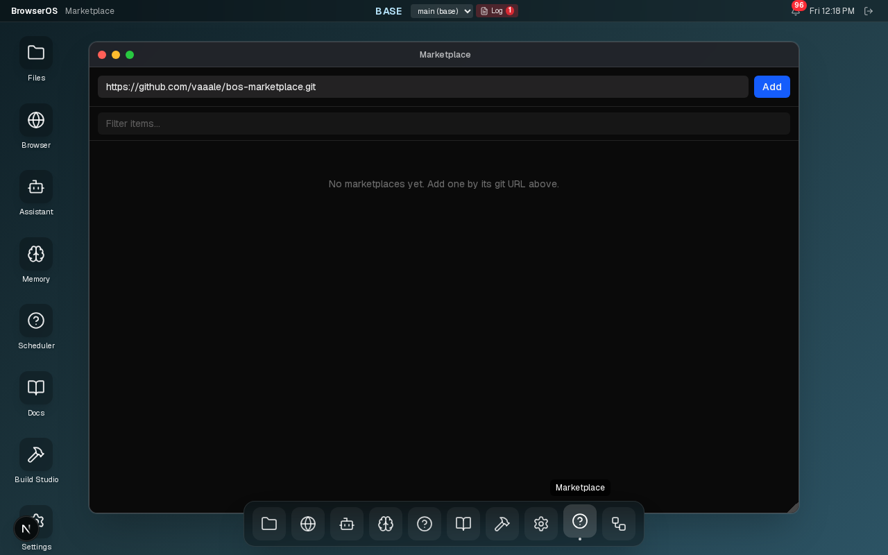
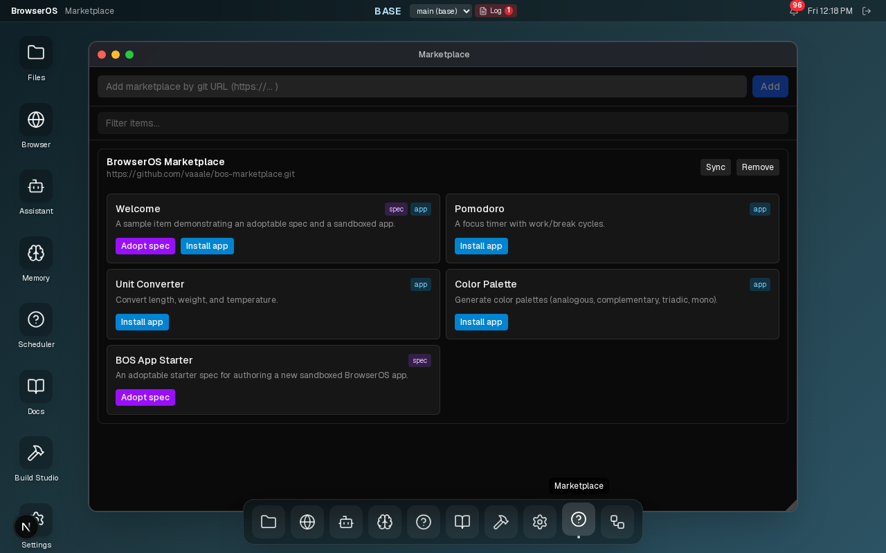
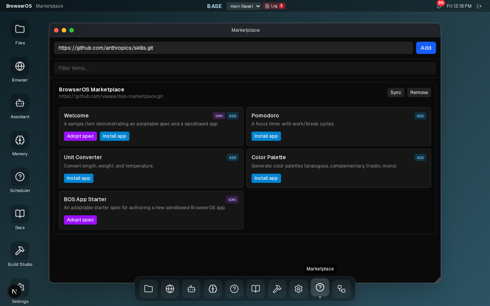
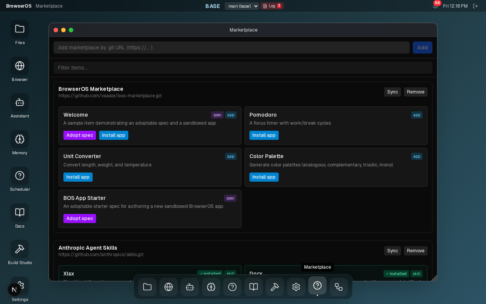
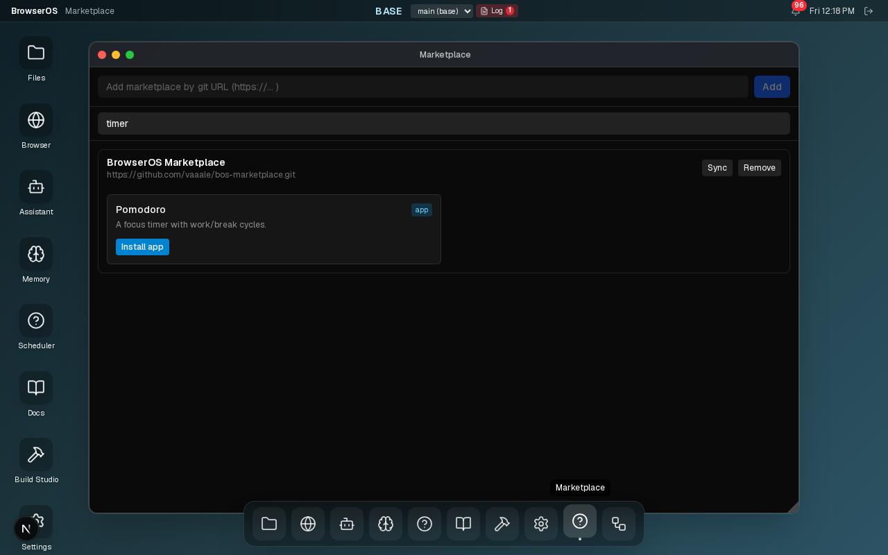
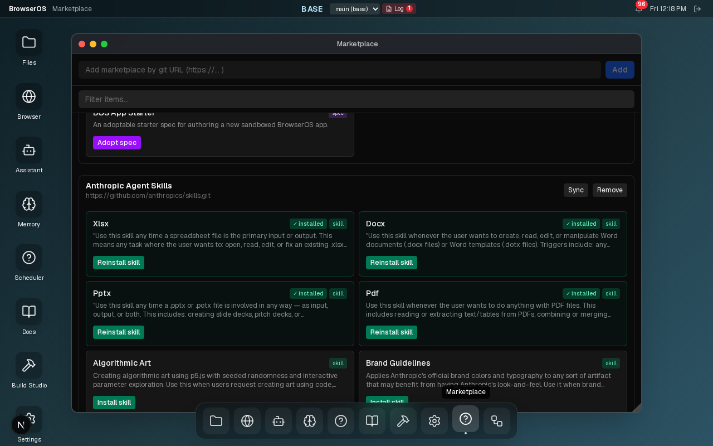
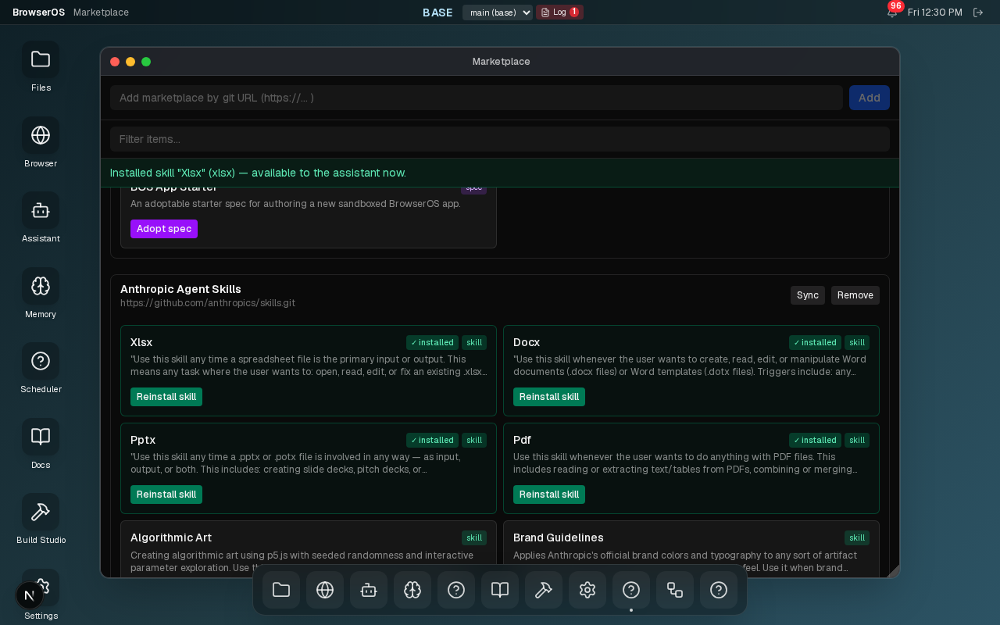
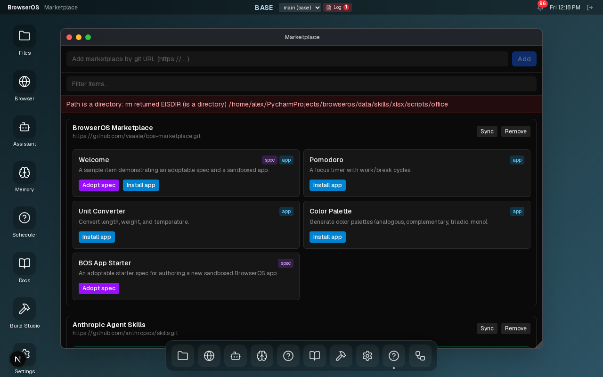
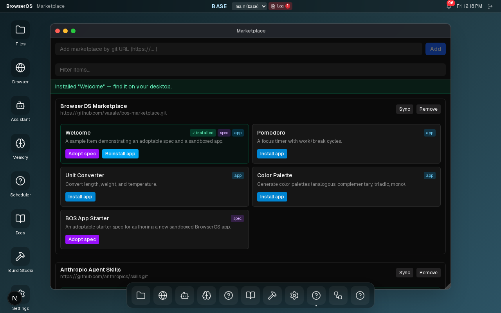

# Tutorial: Using the Marketplace

The **Marketplace** app lets you extend BOS with apps, skills, and spec templates published in external git repositories. Once a marketplace is registered, its contents appear in a browsable catalogue — you can search, preview, and install individual items with a single click.

This tutorial walks through adding two real marketplaces, filtering the catalogue, and installing an app and a skill.

---

## What is a Marketplace?

A marketplace is a git repository that follows one of three recognised formats:

| Format | Used by | What it ships |
|---|---|---|
| **BOS native** (`marketplace.json` at root) | `vaaale/bos-marketplace` | Apps, specs |
| **Claude skills** (`skills_index.json` at root) | `ericgandrade/claude-superskills` | Skills |
| **Anthropic agent-skills** (`.claude-plugin/marketplace.json`) | `anthropics/skills` | Skills |

BOS detects the format automatically when you add the URL — no manual configuration needed.

---

## 1. Open the Marketplace app

Click the **Marketplace** icon in the dock (the grid/shop icon), or ask the assistant:

> *"Open the Marketplace app."*

The app opens empty, ready to accept its first marketplace URL.



---

## 2. Add the BOS Marketplace

The BOS Marketplace ships ready-to-install apps and adoptable spec templates maintained by the BOS team.

Paste the following URL into the **"Add marketplace by git URL"** field at the top:

```
https://github.com/vaaale/bos-marketplace.git
```



Press **Enter** or click **Add**. BOS clones the repository and reads its manifest — this takes a few seconds. Once done, the marketplace section expands with all of its items:



Each item shows one or more type badges:
- `spec` — an adoptable spec template (opens in Build Studio)
- `app` — a pre-built sandboxed app
- `skill` — an assistant skill

---

## 3. Add the Anthropic Skills Marketplace

The Anthropic agent-skills repository publishes a curated set of skills for document processing, design, and more.

Paste this URL and press **Enter** or click **Add**:

```
https://github.com/anthropics/skills.git
```



After the clone completes, BOS detects the Anthropic format automatically and converts it into a browsable catalogue. Both marketplaces are now listed:



Items already installed in your BOS instance are highlighted with a green **✓ installed** badge and a tinted card border, so you can see at a glance what you already have.

---

## 4. Search and filter

With many items across multiple marketplaces, the **Filter items…** field narrows the list in real time. It matches against item names, descriptions, and tags.

For example, type `timer` to instantly find Pomodoro:



The filter hides entire marketplace sections when none of their items match — clear the field to return to the full catalogue.

Some useful searches to try:

| Query | Finds |
|---|---|
| `timer` | Pomodoro focus timer |
| `pdf` | PDF document skill |
| `design` | Design-related skills and apps |
| `spec` | Items that ship a spec template |

---

## 5. Install a skill

Skills extend the assistant — once installed, the assistant can invoke them automatically when the situation matches.

Scroll to any **skill** item (green `skill` badge) and click **Install skill**:



BOS reads the entire skill folder from the marketplace clone — the `SKILL.md` instruction file, any `scripts/`, and all `references/` — and saves everything into the local skill store. A confirmation notice appears at the top and the item card gains a **✓ installed** badge:



The skill is available to the assistant immediately; no restart needed.

> **Tip:** To see your installed skills, open **Settings → Skills**.

---

## 6. Install an app

Apps from the marketplace run in an isolated sandbox so they can't access BOS internals directly. Each app communicates with BOS only through the capability broker.

Scroll to any **app** item (blue `app` badge) and click **Install app**:



BOS copies the pre-built app files into your local app store. A notice confirms the install and the app appears on your desktop immediately — no browser refresh needed:



Click the new icon on your desktop to launch it.

---

## 7. Keep marketplaces up to date

Marketplace repositories are updated independently by their authors. To pull the latest items:

1. Find the marketplace section header.
2. Click **Sync**.

BOS runs `git pull` on the cloned repo and refreshes the catalogue. Any newly published items appear instantly; the **✓ installed** badges on items you've already installed are preserved.

---

## 8. Remove a marketplace

Click **Remove** on any marketplace header to unregister it. BOS deletes the local clone and hides its items from the catalogue.

> **Note:** Removing a marketplace does not uninstall apps or skills you have already installed from it — those remain in your local store.

---

## Summary

| Task | How |
|---|---|
| Add a marketplace | Paste the git URL into the top field, press Enter |
| Browse items | Scroll, or use the filter field to search by name / tag |
| Install a skill | Click **Install skill** on any `skill` item |
| Install an app | Click **Install app** on any `app` item |
| Adopt a spec template | Click **Adopt spec** on any `spec` item |
| Update a marketplace | Click **Sync** in its section header |
| Remove a marketplace | Click **Remove** in its section header |
