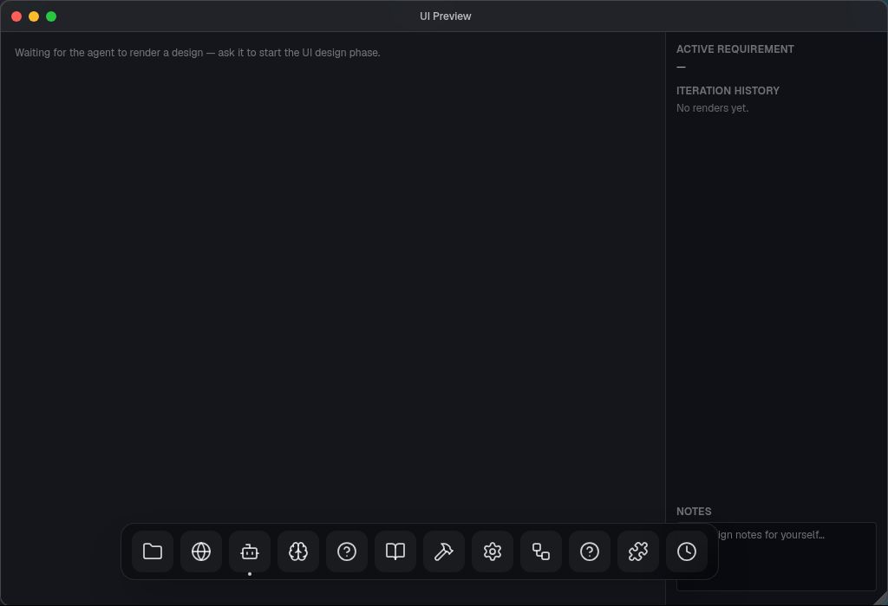
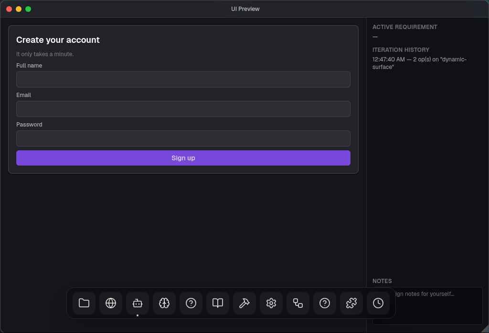
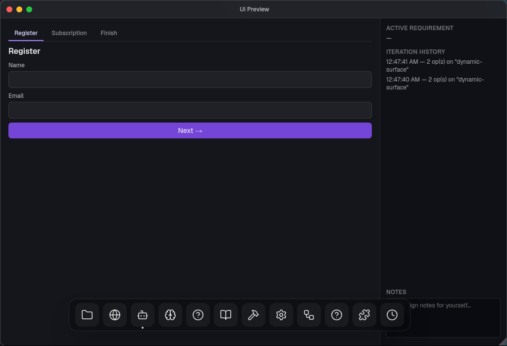
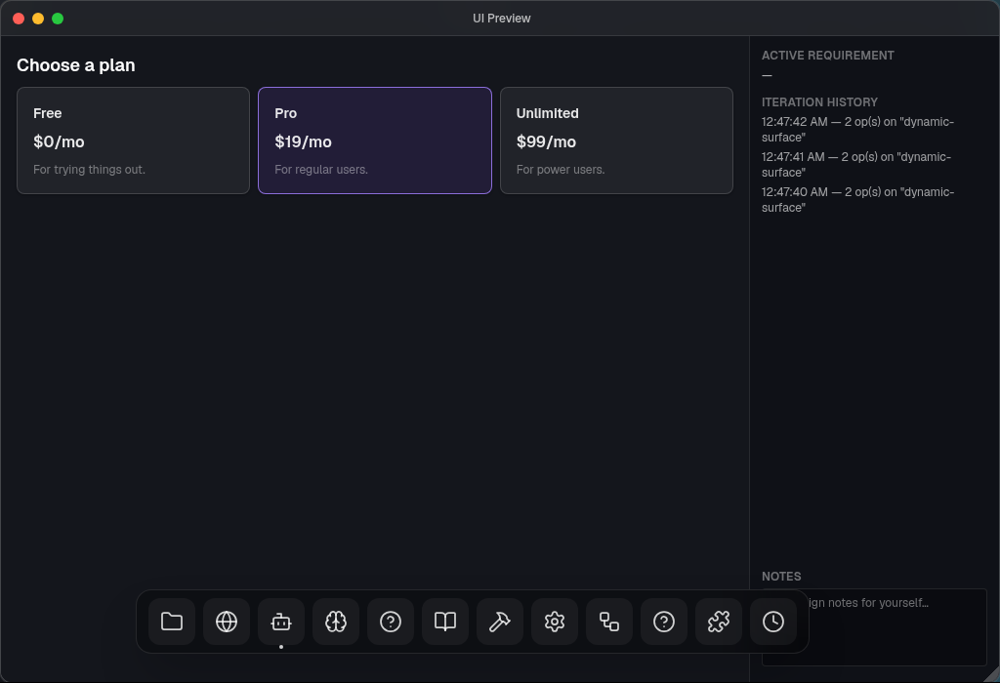

# Tutorial: Designing a UI with the UI Preview app

The **UI Preview** app is a live design canvas. You describe the screen you want in
plain language, and the assistant renders a working mockup you can look at, click
through, and refine — all without writing any code. It's where the *look and feel* of
a BOS app is worked out before the Developer builds the real thing.

This tutorial walks through opening it, sketching a screen, iterating on it, and making
it interactive.

> **What it is (and isn't).** UI Preview renders **mockups** from a fixed set of building
> blocks (text, inputs, cards, tabs, buttons, …). It is a *design surface* — nothing you
> make here ships. When the design is approved, the Developer implements the real UI as
> code. It is **not** a web page: there's no HTML or JavaScript to hand-write; you get
> what you can compose from the component set, and interactivity works through the
> patterns shown below.

---

## 1. Open it

Just ask the assistant:

> *"Open the UI Preview app."*

(During a Build Studio app-design session the assistant opens it for you automatically.)
An empty canvas appears, waiting for a design. The right-hand panel tracks your
**iteration history**, the **active requirement** being designed, and a scratch **notes**
box.

Keep the window open for the rest of your design session.

---

## 2. Describe your first screen

Tell the assistant what you want — focus on **structure and content**, not colours or
spacing (the BOS dark theme is applied automatically). For example:

> *"Show a 'Create your account' card with a Full name field, an Email field, a Password
> field, and a Sign up button."*

The assistant generates the mockup and renders it in one step:

You don't need to know any component names or markup — describe it the way you'd describe
it to a designer.

---

## 3. Iterate

To change what's on screen, just describe the change. The assistant reads the current
mockup and patches it in place, so you only mention what's different:

> *"Add a 'Confirm password' field below Password."*
>
> *"Replace the Sign up button with two buttons: Cancel and Create account."*
>
> *"Make the heading say 'Join us' instead."*

Each request updates the same mockup. Watch the **Iteration history** panel on the right
tick up as you go. If something comes out wrong, don't try to fix it yourself — just
describe it again more specifically, or ask to *"start over"* with a fresh description.

---

## 4. Make it interactive

Mockups here aren't just static pictures — you can make them behave.

### Tabs and multi-step flows

Ask for tabs or a wizard and you get real, clickable tabs:

> *"Make it a three-tab wizard: Register, Subscription, and Finish. On Register put Name
> and Email fields and a Next button that moves to the Subscription tab."*

Clicking a tab header switches to it, and a **Next**/**Back** button can move between
steps too.

### Selectable cards

For "pick one of several options" laid out as panels, ask for selectable cards:

> *"On the Subscription tab, show three plan cards side by side — Free, Pro, and Unlimited,
> each with a price and a short description. Clicking a card selects that plan and
> highlights it."*

Clicking a card highlights its border to show it's chosen; only one is selected at a time.
(For a simpler list of text options, the assistant will use a radio-style picker instead.)

### Inputs and live values

Fields remember what you type, and you can reflect those values elsewhere:

> *"On the Finish tab, show a summary of the entered name, email, and selected plan."*

Type a name on the Register tab, move to Finish, and it shows up in the summary — no code,
just the data flowing through the mockup.

---

## 5. The side panel

The panel on the right of the window gives you design context while you work:

- **Active requirement** — when you're designing against a spec in Build Studio, this
  shows which requirement the current mockup is for.
- **Iteration history** — a running log of each render, so you can see how the design
  evolved.
- **Notes** — a free-text scratchpad for jotting design ideas to yourself; it's just for
  you and isn't sent anywhere.

---

## 6. Tips and limits

- **Describe structure, content, and behaviour — not styling.** "A card with a heading and
  three buttons in a row" works great; "make it blue with 12px padding" is ignored (the
  theme is fixed).
- **Iterate with small changes.** One focused request per turn ("add a Cancel button next
  to Save") is faster and more reliable than re-describing the whole screen.
- **Stay within the building blocks.** There's a fixed component set — text, images, icons,
  rows/columns/lists, cards, tabs, modals, buttons, and form inputs (text field, checkbox,
  choice picker, slider, date/time). Things like data tables, charts, or rich-text editors
  don't exist; the assistant will approximate them (e.g. a list of rows for a table).
- **If a request can't be built,** the assistant will tell you what went wrong and suggest
  how to rephrase — take the hint and simplify or restructure.
- **It's a mockup.** When you're happy with the design, that's the cue to move on to the
  spec and hand implementation to the Developer (see [Build Studio](../apps/build-studio.md)).

---

## Where to go next

- [Build Studio](../apps/build-studio.md) — turn an approved mockup into a spec and a real,
  built feature.
- [Using the assistant](../assistant/using-the-assistant.md) — how to talk to the assistant
  that drives all of this.
