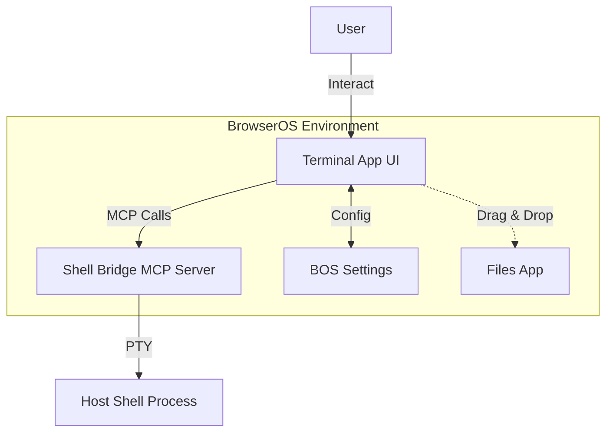

# Terminal App Specification for BrowserOS

## 1. Overview
The **Terminal App** is a native BrowserOS application that provides a graphical user interface (GUI) for interacting with the host operating system's shell via the **Shell Bridge MCP Server**. It features a modern, customizable terminal emulator built on `xterm.js`, supporting multiple sessions, split panes, and deep integration with the BrowserOS environment.

### Purpose
- Provide users with a fully functional terminal emulator within the BrowserOS web environment.
- Leverage the existing Shell Bridge MCP server for secure, low-latency shell access.
- Offer a polished, intuitive UI that matches the BrowserOS design language (wallpapers, dock, settings).

## 2. Architecture

### Components
1.  **Frontend (React + xterm.js)**: The main application window containing the terminal emulator, tab bar, and status bar.
2.  **MCP Client**: A lightweight wrapper that manages connections to the Shell Bridge server and handles tool calls/events.
3.  **Session Manager (UI State)**: Manages UI state for multiple tabs, split panes, and their associated shell sessions.
4.  **Theme Engine**: Handles color schemes, font settings, and opacity based on user preferences.

## 3. User Stories & Features

### US1: Basic Terminal Interaction
- **As a user**, I want to spawn a new shell session and see its output in real-time.
- **As a user**, I want to type commands and have them executed by the host shell.
- **As a user**, I want the terminal to support standard ANSI escape sequences (colors, cursor movement).

### US2: Session Management
- **As a user**, I want to open multiple terminal sessions in separate tabs.
- **As a user**, I want to switch between tabs using keyboard shortcuts (Ctrl+Tab) or mouse clicks.
- **As a user**, I want to close a tab and have its shell session terminated on the host.
- **As a user**, I want to rename a tab (e.g., based on the current directory).

### US3: Split Panes
- **As a user**, I want to split a terminal window horizontally or vertically to view multiple sessions simultaneously.
- **As a user**, I want to resize split panes by dragging the divider.
- **As a user**, I want to close a specific pane without closing the entire window.

### US4: Customization & Appearance
- **As a user**, I want to change the terminal theme (color scheme) via a settings menu.
- **As a user**, I want to adjust font size and family.
- **As a user**, I want to set the background opacity.
- **As a user**, I want the terminal to inherit the BrowserOS wallpaper or use a custom background image.

### US5: Integration with BrowserOS
- **As a user**, I want to drag and drop file paths from the Files app into the terminal.
- **As a user**, I want the terminal window to support standard BOS window controls (minimize, maximize, close).
- **As a user**, I want keyboard shortcuts to work consistently with other BOS apps (e.g., Cmd+W to close tab).

## 4. Technical Requirements

### 4.1 Frontend Stack
- **Framework**: React 18+ (Functional Components, Hooks).
- **Terminal Emulator**: `xterm.js` with `xterm-addon-fit`, `xterm-addon-web-links`, `xterm-addon-search`.
- **State Management**: React Context or Zustand for session/tab state.
- **Styling**: Tailwind CSS (consistent with BOS) + custom CSS modules for terminal overrides.
- **MCP Client**: Custom lightweight client using `@modelcontextprotocol/sdk` (browser-compatible build).

### 4.2 MCP Integration
- **Transport**: The app will use the `stdio` transport configured in BrowserOS to connect to the Shell Bridge.
- **Tool Calls**: 
    - `spawn_shell`: Create a new session.
    - `write_input`: Send keystrokes.
    - `resize_terminal`: Sync window size.
    - `kill_session`: Cleanup on tab close.
- **Event Handling**:
    - `onData`: Stream output to `xterm.js`.
    - `onExit`: Detect session termination and update UI (e.g., show "Process exited" message).

### 4.3 Performance & Latency
- **Input Latency**: < 50ms for keystroke-to-display.
- **Output Rendering**: Efficient delta updates to minimize re-renders.
- **Memory Usage**: Limit number of open tabs/panes to prevent memory exhaustion (soft limit: 10 active sessions).

## 5. UI/UX Design

### 5.1 Layout
- **Header**: Tab bar with "New Tab" button, close buttons on tabs.
- **Main Area**: Container for terminal panes (single or split).
- **Status Bar** (Optional): Current directory, shell name, connection status.
- **Settings Panel**: Modal or slide-out panel for theme/font customization.

### 5.2 Visual Style
- **Theme**: Dark mode by default (BOS standard), with options for light mode and custom schemes.
- **Font**: Monospace (e.g., 'JetBrains Mono', 'Fira Code', 'Consolas').
- **Cursor**: Block, line, or underline (configurable). Blinking cursor enabled.
- **Scrollback**: Configurable buffer size (default: 10,000 lines).

### 5.3 Interactions
- **Right-click Menu**: Copy, Paste, Clear, Split Pane (Horizontal/Vertical), New Tab, Settings.
- **Drag & Drop**: Accept file paths from Files app; convert to absolute paths.
- **Keyboard Shortcuts**:
    - `Cmd+T`: New Tab
    - `Cmd+W`: Close Tab
    - `Cmd+N`: New Window (if supported by BOS window manager)
    - `Ctrl+C`: Send SIGINT (handled by shell, not app)
    - `Ctrl+Shift+C/V`: Copy/Paste (override browser defaults if needed)

## 6. Security Considerations
- **Input Validation**: No client-side sanitization of commands (trust the user and the Shell Bridge security layer).
- **Session Isolation**: Each tab/pane gets a unique session ID; no cross-talk between sessions.
- **Path Traversal**: When dragging files, ensure paths are resolved to absolute paths within allowed roots.
- **MCP Permissions**: The app must request permission to use the Shell Bridge server (handled by BOS MCP framework).

## 7. Configuration Options
Users can configure the following via a Settings UI:
- **Theme**: Color scheme selector (BOS Default, Dracula, Monokai, Solarized, etc.).
- **Font**: Family and size (10px - 24px).
- **Cursor Style**: Block, Line, Underline.
- **Opacity**: 50% - 100%.
- **Scrollback**: Number of lines to retain.
- **Bell Sound**: Enable/disable terminal bell.
- **Default Shell**: Override the system default (e.g., force `zsh` or `fish`).

## 8. Error Handling
- **Connection Lost**: If the Shell Bridge disconnects, show a "Reconnecting..." overlay with retry logic.
- **Session Failed to Spawn**: Display an error message in the terminal area with details (e.g., "Shell not found: /bin/zsh").
- **Invalid Input**: If `write_input` fails, log to console and show a toast notification (if critical).

## 9. Future Enhancements (Out of Scope for MVP)
- **Command History Search**: Fuzzy search through command history.
- **SSH Integration**: Built-in SSH client UI.
- **File Transfer**: Drag-and-drop file upload/download via SFTP.
- **Plugins**: Support for custom terminal plugins/extensions.

## 10. Success Criteria
1.  **Functionality**: Users can open a terminal, run commands, and see output correctly.
2.  **Performance**: No noticeable lag when typing or scrolling.
3.  **Usability**: Intuitive UI with standard keyboard shortcuts.
4.  **Integration**: Seamless drag-and-drop with Files app; consistent look and feel with BOS.
5.  **Stability**: Handles session crashes and reconnections gracefully.

## Clarifications

### Session 2026-06-29 — Initial Specification Review

**Q**: Should the Terminal App manage the Shell Bridge server lifecycle?  
**A**: No. The Shell Bridge is a separate MCP server managed by BrowserOS. The Terminal App acts as a client connecting to it.

**Q**: Is WebSocket transport required for the frontend?  
**A**: No. The app will use the standard BrowserOS MCP transport (likely `stdio` via a bridge) to communicate with the Shell Bridge.

**Q**: Should split panes share the same shell session or have separate ones?  
**A**: Separate sessions. Each pane/tab gets its own unique session ID from the Shell Bridge.

**Clarify Phase Status**: COMPLETE — Specification is ready for design and implementation planning.