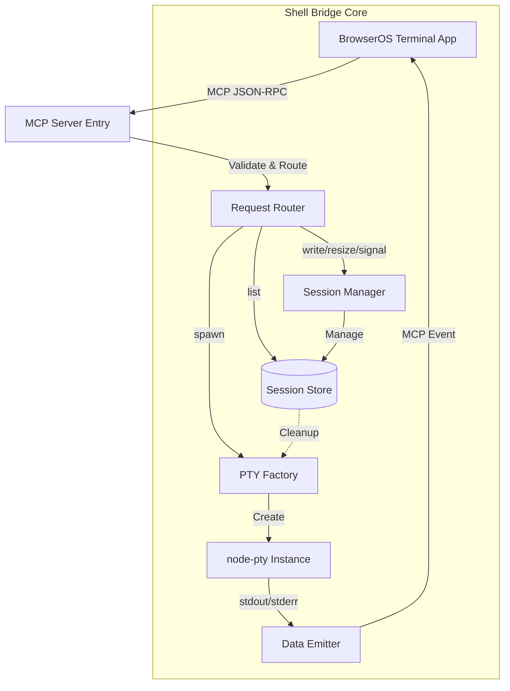

# Terminal Shell Bridge - Architecture & Implementation Design

## 1. Introduction
This document details the technical implementation of the **Shell Bridge MCP Server**. It expands upon `spec.md` by defining the internal architecture, data models, class structures, and specific algorithms required to build a robust, secure, and low-latency terminal bridge.

## 2. System Architecture

### 2.1 High-Level Component Diagram


### 2.2 Module Responsibilities

| Module | Responsibility | Dependencies |
|--------|----------------|--------------|
| `main.ts` | Server entry, transport setup (stdio/HTTP), logging config. | `@modelcontextprotocol/sdk` |
| `router.ts` | Parses incoming JSON-RPC requests, validates schemas, routes to handlers. | `zod` |
| `session-manager.ts` | Core logic for session lifecycle: creation, lookup, cleanup, and state tracking. | `uuid`, `node-pty` |
| `pty-factory.ts` | Handles the low-level `node-pty.spawn()` call, environment merging, and initial config. | `node-pty`, `os` |
| `data-emitter.ts` | Manages the bidirectional stream: PTY output -> MCP Event, MCP Input -> PTY stdin. | `stream` |
| `security.ts` | Implements command filtering (optional), resource limit checks, and input sanitization. | - |

## 3. Data Models & State Management

### 3.1 Session Object Structure
The in-memory representation of a shell session:

```typescript
interface ShellSession {
  id: string;              // UUID v4
  pid: number;             // Host Process ID
  shell: string;           // Executable path (e.g., /bin/bash)
  cwd: string;             // Current working directory
  cols: number;            // Terminal width
  rows: number;            // Terminal height
  ptyProcess: pty.IPty;    // The actual node-pty instance
  createdAt: number;       // Unix timestamp (ms)
  lastActivity: number;    // Last interaction timestamp (for timeout)
  status: 'running' | 'exited' | 'killed';
  env: NodeJS.ProcessEnv;  // Merged environment variables
}
```

### 3.2 Session Store Implementation
- **Type**: `Map<string, ShellSession>`
- **Concurrency**: Since Node.js is single-threaded, standard Map access is thread-safe for this use case. No locking mechanism required unless using worker threads (not planned).
- **Cleanup Strategy**: 
  - **Lazy Cleanup**: Triggered on `kill_session` or session lookup failure.
  - **Periodic Cleanup**: A `setInterval` runs every 60s to check `lastActivity` against `MCP_SHELL_TIMEOUT`.

### 3.3 Error Handling Model
All errors are wrapped in a standardized structure before being sent via MCP:

```typescript
interface BridgeError {
  code: number;            // Standard MCP error codes (-32000 range)
  message: string;         // Human-readable description
  details?: any;           // Optional context (e.g., sessionId, pid)
}
```

**Error Codes:**
- `SESSION_NOT_FOUND` (-32001): Session ID invalid or expired.
- `SHELL_SPAWN_FAILED` (-32002): Process could not be started (e.g., shell not found).
- `INVALID_INPUT` (-32003): Malformed data or arguments.
- `RESOURCE_LIMIT_EXCEEDED` (-32004): Max sessions reached.
- `PERMISSION_DENIED` (-32005): Security filter blocked operation.

## 4. Algorithm & Logic Details

### 4.1 Session Spawn Algorithm (`spawn_shell`)
1. **Validation**: Check if `cwd` exists using `fs.access`. If not, reject.
2. **Resource Check**: Count active sessions. If `count >= MAX_SESSIONS`, reject with `RESOURCE_LIMIT_EXCEEDED`.
3. **Env Merging**: 
   - Start with `process.env`.
   - Overwrite with user-provided `env`.
   - Ensure `TERM` is set to `xterm-256color`.
4. **PTY Creation**: Call `pty.spawn(shell, args, { cols, rows, env, cwd })`.
5. **Event Wiring**: 
   - Attach `data` listener to PTY -> Emit `onData` MCP event.
   - Attach `exit` listener to PTY -> Emit `onExit` MCP event and mark session status.
6. **Storage**: Store new `ShellSession` object in `SessionStore`.
7. **Response**: Return `{ sessionId, pid, cwd }`.

### 4.2 Input/Output Streaming Logic
- **Input (Client -> Host)**:
  - `write_input` receives string `data`.
  - Validate length (max 64KB per write to prevent buffer overflow).
  - Call `session.ptyProcess.write(data)`.
  - Update `lastActivity` timestamp.
  
- **Output (Host -> Client)**:
  - PTY `data` event fires with Buffer/String.
  - Encode data as Base64 if binary, or Raw String if text-safe.
  - Construct MCP Event payload: `{ sessionId, data, type: 'stdout' }`.
  - Push to MCP client stream immediately (no buffering).

### 4.3 Resize Logic (`resize_terminal`)
1. Lookup session by ID.
2. Validate `cols` and `rows` are > 0.
3. Call `session.ptyProcess.resize(cols, rows)`.
4. Update internal `session.cols` and `session.rows`.
5. Return success.

### 4.4 Signal Handling (`send_signal`)
1. Lookup session.
2. Map signal name (e.g., "SIGINT") to OS signal number (e.g., 2).
3. **Security Check**: If signal is `SIGKILL` and policy is strict, require confirmation or block.
4. Call `process.kill(session.pid, signalNumber)`.
5. Handle potential `ESRCH` error if process already exited.

## 5. Security Implementation Details

### 5.1 Input Sanitization
- **Path Traversal**: Ensure `cwd` does not contain `..` sequences that escape allowed roots (if configured).
- **Shell Injection**: Since we spawn the shell directly, we do not parse commands ourselves. However, `write_input` data is passed raw to the PTY. No sanitization is performed on input to preserve terminal integrity (e.g., allowing `rm -rf`).

### 5.2 Resource Limits (DoS Protection)
- **Max Sessions**: Hard limit enforced in `spawn_shell`.
- **Input Size**: Max 64KB per `write_input` call.
- **Idle Timeout**: 
  - Background task checks every 60s.
  - If `Date.now() - session.lastActivity > MCP_SHELL_TIMEOUT`, auto-kill session.

### 5.3 Command Filtering (Optional Feature)
*Note: This is a future enhancement, but the design allows for it.*
- If `enableStrictFiltering` is true:
  - Before `write_input` executes, scan `data` against a regex blacklist (e.g., `rm\s+-rf\s+/`).
  - If match found, return `PERMISSION_DENIED` with a warning message.

## 6. Technology Stack & Dependencies

| Library | Version | Purpose |
|---------|---------|---------|
| `@modelcontextprotocol/sdk` | ^1.0.0 | MCP server implementation, transport handling. |
| `node-pty` | ^1.0.0 | Cross-platform PTY spawning and management. |
| `uuid` | ^9.0.0 | Generating unique session IDs. |
| `zod` | ^3.22.0 | Runtime schema validation for tool inputs. |
| `ts-node` / `tsx` | Latest | TypeScript execution for development. |
| `typescript` | ^5.0.0 | Type safety and compilation. |

## 7. File Structure (Implementation)

```
mcp-servers/shell-bridge/
├── src/
│   ├── index.ts              # Entry point: Server init, transport selection
│   ├── server.ts             # MCP Server instance setup
│   ├── router.ts             # Tool routing and validation logic
│   ├── session-manager.ts    # Core session lifecycle logic
│   ├── pty-factory.ts        # node-pty wrapper and env handling
│   ├── data-emitter.ts       # Stream bridging (PTY <-> MCP Events)
│   ├── security.ts           # Limits, filtering, sanitization
│   ├── types.ts              # TypeScript interfaces
│   └── utils.ts              # Helpers (logging, error formatting)
├── tests/
│   ├── session-manager.test.ts
│   └── pty-factory.test.ts
├── package.json
├── tsconfig.json
└── README.md
```

## 8. Testing Strategy

### 8.1 Unit Tests
- **Session Manager**: Test creation, lookup, and cleanup logic (mocking `node-pty`).
- **Security**: Test resource limit enforcement and input size validation.
- **Router**: Test schema validation for all tools.

### 8.2 Integration Tests
- **Spawn & Kill**: Spawn a shell, verify PID, kill it, verify cleanup.
- **I/O Loop**: Send input, verify output event is received with correct data.
- **Resize**: Resize terminal, verify `SIGWINCH` was sent (mock check).
- **Signal**: Send SIGINT, verify process termination.

### 8.3 Manual Testing
- Connect via a simple MCP client (e.g., `mcp-cli`).
- Run interactive programs (`vim`, `top`, `htop`) to verify full VT100 support.
- Test Unicode input/output.
- Test large output streams (cat /dev/urandom | head).

## 9. Deployment & Integration

### 9.1 Local Development
- Run via `tsx src/index.ts` in `stdio` mode.
- Connect using BrowserOS MCP client configured for `stdio`.

### 9.2 Production (BrowserOS)
- Packaged as a standard Node.js app.
- Registered in BrowserOS Settings → MCP Servers.
- Transport: `stdio` (spawned by BOS when needed).

## 10. Future Considerations
- **Worker Threads**: If PTY blocking becomes an issue, move PTY logic to a worker thread.
- **WebSockets**: Add HTTP/SSE transport support for remote access.
- **Persistency**: Save session history to disk on `onExit`.
